# Haarlem Festival Part 2

Haarlem Festival Part 2 is a PHP web application for managing and presenting a multi-event festival experience. The project combines a public-facing website for visitors with an internal CMS for managing festival content, users, orders, tickets, and event data.

The application includes modules for Dance, Jazz, History, Yummy, Stories, reservations, user accounts, payments, ticket scanning, and CMS administration.

## Project Highlights

- Public festival website with multiple event domains
- CMS for pages, artists, passes, users, orders, venues, tickets, and event management
- Stripe payment integration
- Mail support through SMTP
- QR code generation and ticket scanning flows
- Docker-based local development environment
- Project diagrams included in `docs/diagrams`

## Diagrams

The repository already contains project diagrams. These are useful before making structural or database changes.

### Database ERD

- SVG: [docs/diagrams/database-erd.svg](docs/diagrams/database-erd.svg)
- PDF: [docs/diagrams/database-erd.pdf](docs/diagrams/database-erd.pdf)



### Class Diagram

- SVG: [docs/diagrams/class-diagram.svg](docs/diagrams/class-diagram.svg)
- PDF: [docs/diagrams/class-diagram.pdf](docs/diagrams/class-diagram.pdf)



## Technology Stack

- PHP 8.4 with PHP-FPM
- Nginx
- Docker Compose
- Composer
- FastRoute for routing
- Phinx for migrations
- PHPMailer for email delivery
- Stripe PHP SDK for payment processing
- FPDF for PDF generation
- PHP QR Code library

## Repository Structure

```text
.
|-- PHP.Dockerfile
|-- docker-compose.yml
|-- nginx.conf
|-- README.md
|-- app/
|   |-- composer.json
|   |-- composer.lock
|   |-- phinx.php
|   |-- public/
|   |   |-- index.php
|   |   `-- assets/
|   |-- src/
|   |   |-- Cms/
|   |   |-- Controllers/
|   |   |-- Framework/
|   |   |-- Models/
|   |   |-- Repositories/
|   |   |-- Services/
|   |   |-- Support/
|   |   |-- Utils/
|   |   |-- ViewModels/
|   |   `-- Views/
|   `-- vendor/
|-- certs/
|-- docs/
|   `-- diagrams/
`-- tools/
```

## Architecture Overview

### Request Flow

1. Nginx serves the application and forwards PHP requests to the `php` container.
2. `app/public/index.php` acts as the front controller.
3. FastRoute maps incoming routes to controllers.
4. Controllers delegate business logic to services.
5. Services coordinate repositories, models, and integrations.
6. Views render the final output for the browser.

### Main Application Areas

- `app/src/Controllers`: public-facing controllers for festival modules and user actions
- `app/src/Cms/Controllers`: CMS controllers for administrative functionality
- `app/src/Services`: business logic and integration handling
- `app/src/Repositories`: persistence layer and database access
- `app/src/Models`: domain entities and data objects
- `app/src/Views`: templates used by the web interface
- `app/public/assets`: front-end assets served by Nginx and the front controller

### Functional Modules

- Home: landing page and cross-festival entry point
- Dance: dance event pages and related content
- Jazz: jazz event and artist pages
- History: history event pages and detail views
- Yummy: restaurant-related event pages and reservations
- Stories: editorial or story-driven pages
- Program: personal program handling for users
- Orders and Payment: cart, checkout, and Stripe webhook flows
- Authentication: login, registration, password reset, and account management
- Scanner: admin or employee ticket scanning workflow
- CMS: content, event, ticket, venue, user, order, pass, and artist management

## Local Development

### Prerequisites

Install the following before starting:

- Docker Desktop
- Docker Compose support
- Composer on the host machine if you want to run dependency commands outside the container

### Environment Configuration

The project expects a root-level `.env` file. Review and update it before running the stack.

Typical configuration areas include:

- database connection settings
- SMTP credentials
- Stripe API keys
- mail sender identity
- SSL certificate path for the remote database connection

If this repository is shared beyond a private local environment, move real credentials out of `.env` and use a safe secret management approach.

## Startup Instructions

These steps are the recommended way to start the project locally.

### 1. Install Composer dependencies

Run Composer once before the first start so the host-mounted `app/vendor` directory is present:

```bash
docker compose run --rm php composer install --working-dir=/app --no-interaction --no-progress
```

You can also use a local Composer installation:

```bash
cd app
composer install
```

### 2. Build and start the containers

From the project root, run:

```bash
docker compose up --build
```

### 3. Open the application

- Main application: http://localhost
- phpMyAdmin: http://localhost:8080

### Default Admin Credentials

Use the following credentials for the default admin account:

- Username: `admin`
- Password: `adminadmin`

user account:

- Username: `wolfik`
- Password: `qwerty123`

### 4. Stop the environment

```bash
docker compose down
```

## Composer and Docker Behavior

Composer installation is handled in more than one place so the environment is reliable during local development.

### During Docker image build

The PHP image in `PHP.Dockerfile` installs Composer and runs:

```bash
composer install --working-dir=/app --no-interaction --no-progress --optimize-autoloader
```

This ensures dependencies are present in the built image.

### During container startup

Because `./app` is mounted into the container, the mounted folder can replace the image contents at runtime. For that reason, the PHP container checks whether dependencies are missing or outdated and runs Composer again when needed before `php-fpm` starts.

### Recommended workflow

Use this order:

1. Update `.env`
2. Run `composer install`
3. Start the stack with `docker compose up --build`

This gives you the fastest feedback loop and avoids vendor mismatch problems.

## Useful Commands

### Rebuild only the PHP image

```bash
docker compose build php
```

### Run Composer inside the PHP container

```bash
docker compose run --rm php composer install --working-dir=/app
```

### Open a shell inside the PHP container

```bash
docker compose exec php sh
```

### View container logs

```bash
docker compose logs -f
```

### Restart the stack

```bash
docker compose down
docker compose up --build
```

## Web Server and Container Setup

### Nginx

- listens on port `80`
- serves the document root from `app/public`
- forwards PHP requests to the `php` service on port `9000`
- supports uploads up to `20 MB`

### PHP Container

- based on `php:8.4-fpm`
- installs required system libraries
- installs `gd`, `zip`, `pdo`, and `pdo_mysql`
- attempts to install Microsoft SQL drivers for environments that need them
- installs Composer globally
- prepares writable upload directories on startup

### phpMyAdmin

- exposed on port `8080`
- reads connection values from `.env`
- configured to work with SSL CA certificates

## Application Entry Point and Routing

The front controller is located at `app/public/index.php`.

This file is responsible for:

- loading Composer autoloading
- loading environment variables
- serving certain static assets through the front controller when needed
- registering all application routes
- dispatching requests to controllers

The route map shows that the system includes both public and CMS routes, with dedicated controllers for each major festival area.

## Dependency Overview

Key Composer dependencies from `app/composer.json` include:

- `nikic/fast-route`
- `robmorgan/phinx`
- `phpmailer/phpmailer`
- `chillerlan/php-qrcode`
- `stripe/stripe-php`
- `setasign/fpdf`

## Database and Migrations

The project includes Phinx configuration in `app/phinx.php`.

The migration configuration reads database connection details from environment variables and supports multiple environments using the same base configuration.

Before running migration commands, ensure the database credentials in `.env` are correct.

Example command:

```bash
docker compose run --rm php php /app/vendor/bin/phinx migrate -c /app/phinx.php
```

## Media, Assets, and Uploads

- static assets are stored under `app/public/assets`
- profile images are prepared under `app/public/assets/img/profiles`
- upload limits are configured in the PHP container

If image uploads fail locally, verify that the PHP container has write access to the assets directory.

## Troubleshooting

### Dependencies are missing

Run:

```bash
docker compose run --rm php composer install --working-dir=/app
```

### Containers build but the site does not load

Check:

- `.env` values
- whether Docker Desktop is running
- whether port `80` or `8080` is already in use
- container logs with `docker compose logs -f`

### Database connection issues

Check:

- database host, port, username, password, and database name
- SSL CA file mount paths
- firewall or remote service access restrictions

### Payment or mail features do not work

Check:

- Stripe keys in `.env`
- SMTP host, port, username, password, and encryption settings
- application logs and webhook configuration

## Development Notes

- The project uses a mounted `app/` folder for active development.
- The Docker image installs dependencies, but local development still benefits from running Composer once against the mounted volume.
- The diagrams in `docs/diagrams` should be reviewed before making domain model or schema changes.

## Recommended Reading Order for New Contributors

1. Review the diagrams in `docs/diagrams`
2. Read `app/public/index.php` to understand routing
3. Inspect `app/src/Controllers` and `app/src/Cms/Controllers`
4. Review services and repositories for business logic and persistence flow
5. Use `docker compose up --build` to validate the local environment
